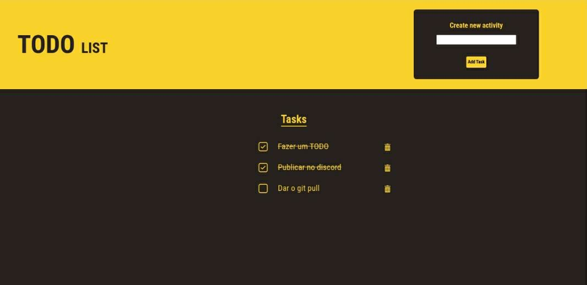

## Concepts of ReactJS  

---
### About it :bookmark_tabs:

This project is a Todo List build with ReactJS and Vite. It has three functionalities: 
- Add a new task
- Update a task 
- Remove a task

### Installation :floppy_disk:

This project requires yarn (or npm) and nodeJS.

Install the dependencies and devDependencies and start and the application with yarn dev.

```sh
yarn install
yarn dev
```

### Screens



### Author :rocket:

Give it a :star: if you enjoyed the project !

**Free Software!!**
